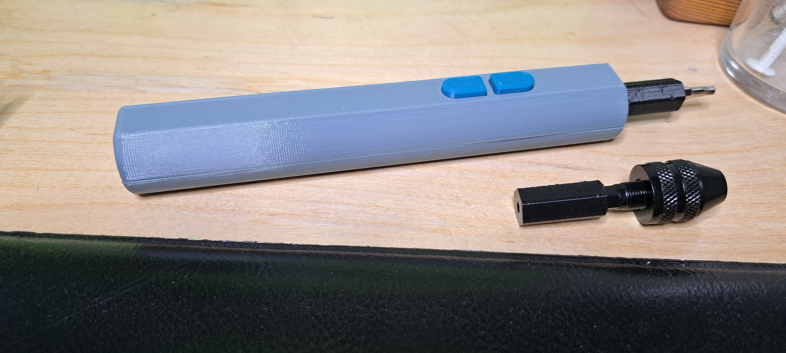
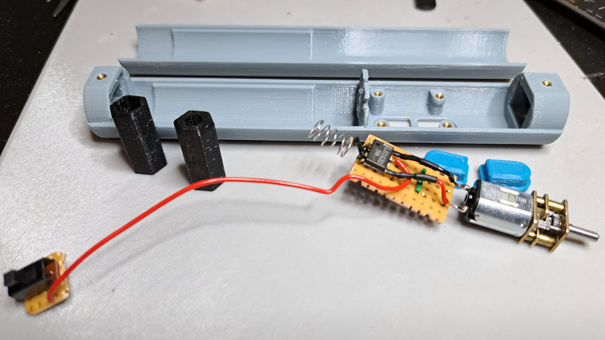
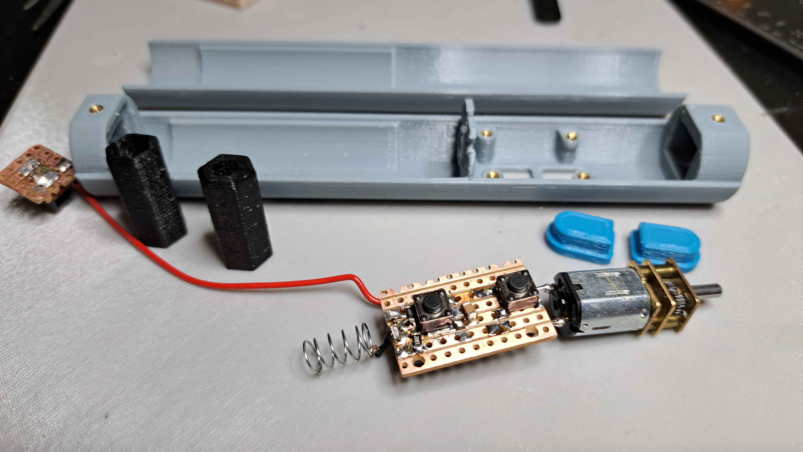

# Meisseli - 3D printed electric screw driver

Adapter for 4mm and 6.35mm bits included, along with Build123D code for customization.

# Stuff needed

- 6x M2 x 6mm countersunk (pcb and case mount)
- 2x M1.6 x 4mm countersunk (motor mount)
- 6x M2 heat set inserts, the one near the motor needs to be short
- a motor like (https://www.aliexpress.com/item/1005005499465760.html) (type A)
- 18650 battery, use one with a protection PCB included unless you feel like doing something fancier with the motor control PCB. The battery bay is longer to accompany such a battery.
- a switch, two press buttons, a spring and such miscellaneous stuff

# Optional

 - [A mini drill chuck](https://aliexpress.com/item/1005007473416050.html)

# Motor control

I had an old LB1630 driver around, winged a franken-vero-board with two pull-down 1206 SMD resistors and a cap. There's a sketchy sketch as veroboard.gnumeric. You might want to do something saner instead.

# Warranty

None whatsoever, I'm not responsible for anything you do.
